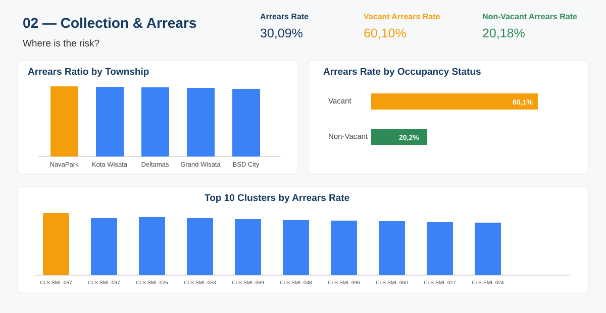
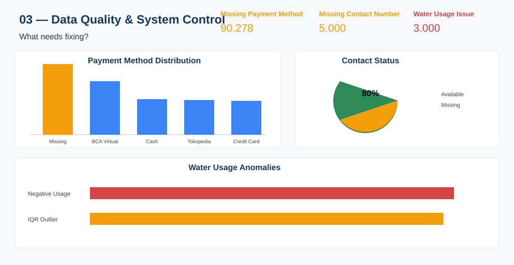

# Sinarmas Land — Data Analysis

Capstone 2 — Data Analysis Portfolio Project

## Project Overview

Analisis data billing dan property management untuk mengidentifikasi risiko tunggakan, peluang revenue recovery, serta masalah kualitas data pada proses billing.

## Business Questions

1. Township atau cluster mana yang memiliki arrears rate tertinggi?
2. Apakah unit vacant memiliki tingkat tunggakan yang lebih tinggi?
3. Berapa nilai outstanding dan bagaimana distribusinya?
4. Apakah terdapat tunggakan kronis lebih dari 6 bulan berturut-turut?
5. Seberapa besar masalah missing payment method dan contact number?
6. Apakah terdapat anomali pada payment date dan water usage?

## Key Findings

| Metric | Result |
|---|---:|
| Total Invoices | 300,000 |
| Total Outstanding | Rp117.26 Miliar |
| Vacant Units | 6,178 |
| Vacant Arrears Rate | 60.10% |
| Non-Vacant Arrears Rate | 20.18% |
| Missing Payment Method | 90,278 |
| Missing Contact Number | 5,000 |
| Paid Before Handover | 6,291 |
| Water Usage Issues | 3,000 |
| Chronic Arrears Streaks (>6 months) | 6 |
| Chronic Arrears Outstanding | Rp117.88 juta |

## Dashboard

**Interactive Dashboard:** [Open Looker Studio Dashboard](https://datastudio.google.com/u/0/reporting/fd29a56f-cb8b-4e0f-8afa-0c4a405d68a9/page/4vUAG)

Dashboard dirancang menjadi tiga halaman agar proses analisis mengikuti alur bisnis: **What is happening? → Where is the risk? → What needs fixing?**

### Page 1 — Executive Overview

**Pertanyaan utama:** *What is happening?*

Halaman ini memberikan gambaran kondisi billing secara keseluruhan dan menjadi titik awal untuk memahami skala masalah sebelum masuk ke analisis yang lebih spesifik.

**KPI yang ditampilkan:**
- **Total Invoices:** 300,000 invoice
- **Total Outstanding:** Rp117.26 miliar dari invoice Unpaid + Overdue
- **Paid Rate:** 69.91%
- **Vacant Units:** 6,178 unit

**Chart yang digunakan:**

**1. Outstanding Billing by Township — Bar Chart**  
Digunakan untuk membandingkan nilai outstanding antar-township secara langsung. Bar chart memudahkan pengguna melihat wilayah dengan exposure nominal terbesar dan menentukan prioritas berdasarkan nilai outstanding, bukan hanya rasio.

**Isi:** Outstanding billing untuk BSD City, Kota Wisata, Grand Wisata, Deltamas, dan NavaPark. BSD City memiliki outstanding nominal terbesar, sekitar Rp39.04 miliar.

**2. Monthly Outstanding Trend — Line Chart**  
Digunakan untuk melihat perubahan outstanding dari waktu ke waktu dan membantu mengidentifikasi periode ketika tunggakan mulai muncul atau meningkat.

**Isi:** Tren outstanding bulanan sepanjang periode billing 2018–2024. Pada 2018–2021 seluruh invoice tercatat lunas, 2022 tidak memiliki data billing, sedangkan outstanding mulai muncul kembali pada 2023–2024.

**3. Payment Status Distribution — Bar Chart**  
Digunakan untuk melihat komposisi invoice berdasarkan status pembayaran sehingga kondisi collection dapat dipahami secara cepat.

**Isi:** Paid, Overdue, dan Unpaid, dengan total masing-masing 209,722; 52,754; dan 37,524 invoice.

**Business purpose:** Page 1 menjawab pertanyaan dasar tentang skala outstanding, distribusi risiko secara geografis, perkembangan tunggakan, dan kondisi pembayaran secara keseluruhan.

### Page 2 — Collection & Arrears

**Pertanyaan utama:** *Where is the risk?*

Halaman ini berfokus pada identifikasi area dan karakteristik unit yang memiliki risiko tunggakan lebih tinggi sehingga collection dapat diprioritaskan.

**KPI yang ditampilkan:**
- **Overall Arrears Rate:** 30.09%
- **Vacant Arrears Rate:** 60.10%
- **Non-Vacant Arrears Rate:** 20.18%

**Chart yang digunakan:**

**1. Arrears Ratio by Township — Bar Chart**  
Digunakan untuk membandingkan tingkat tunggakan relatif antar-township. Rasio lebih tepat daripada nominal ketika tujuan analisis adalah mencari wilayah dengan proporsi invoice bermasalah yang paling tinggi.

**Isi:** Arrears ratio untuk setiap township. NavaPark memiliki arrears ratio tertinggi sebesar 30.43%.

**2. Vacant vs Non-Vacant — Comparison Chart**  
Digunakan untuk membandingkan risiko tunggakan berdasarkan status hunian unit.

**Isi:** Perbandingan arrears rate unit **Vacant** sebesar 60.10% dengan **Non-Vacant** sebesar 20.18%. Hasil ini menunjukkan risiko tunggakan jauh lebih tinggi pada unit vacant. Analisis statistik pada project juga menunjukkan adanya asosiasi antara status hunian dan status pembayaran; hasil ini digunakan sebagai dasar prioritisasi, bukan sebagai bukti hubungan sebab-akibat.

**3. Top 10 Cluster Arrears Ratio — Bar Chart**  
Digunakan untuk melakukan drill-down dari tingkat township ke tingkat cluster dan menemukan cluster dengan tingkat tunggakan tertinggi.

**Isi:** Sepuluh cluster dengan arrears ratio tertinggi, dengan **CLS-SML-067** sebagai cluster dengan rasio tertinggi, sekitar 34.10%.

**Business purpose:** Page 2 membantu tim Collection dan Estate Management menjawab **di mana risiko tunggakan paling tinggi dan segmen unit mana yang perlu diprioritaskan**.

### Page 3 — Data Quality & System Control

**Pertanyaan utama:** *What needs fixing?*

Halaman ini berfokus pada masalah kualitas data dan exception pada sistem billing yang dapat menghambat rekonsiliasi, collection, serta keandalan proses operasional.

**KPI yang ditampilkan:**
- **Missing Payment Method:** 90,278
- **Missing Contact Number:** 5,000
- **Water Usage Issues:** 3,000
- **Paid Before Handover:** 6,291

**Chart yang digunakan:**

**1. Payment Method Distribution — Bar Chart**  
Digunakan untuk melihat kelengkapan dan konsistensi pencatatan metode pembayaran setelah label pembayaran dinormalisasi.

**Isi:** Distribusi payment method setelah standardisasi, termasuk kategori **Missing**. Terdapat 90,278 invoice dengan payment method kosong.

**2. Contact Status — Pie Chart**  
Digunakan untuk menunjukkan proporsi owner record yang memiliki dan tidak memiliki nomor kontak. Karena hanya terdapat dua kategori utama, pie chart efektif untuk memperlihatkan part-to-whole composition.

**Isi:** **Available** 80% dan **Missing** 20% atau 5,000 dari 25,000 owner records.

**3. Water Usage Anomalies — Bar Chart**  
Digunakan untuk membandingkan dua jenis exception penggunaan air yang berbeda agar tim operasional dapat melihat skala masalah dengan cepat.

**Isi:** **Negative Usage** sebanyak 1,519 record dan **IQR Outlier** sebanyak 1,481 record. Batas atas outlier IQR yang digunakan adalah 87 m³.

**Business purpose:** Page 3 mengarahkan perhatian pada **data yang perlu dibersihkan dan rule sistem yang perlu diperketat**, termasuk standardisasi payment method, pelengkapan contact data, validasi payment date terhadap handover date, serta pengecekan input meter air ekstrem.

### Dashboard Flow

Ketiga halaman disusun sebagai alur analisis:

**Page 1 — Executive Overview** → memahami kondisi dan skala masalah  
**Page 2 — Collection & Arrears** → menemukan lokasi dan segmen dengan risiko tertinggi  
**Page 3 — Data Quality & System Control** → menemukan data dan exception yang perlu diperbaiki

Dengan alur ini, dashboard tidak hanya menampilkan angka, tetapi menghubungkan **insight → prioritas bisnis → tindakan operasional**.

## Dashboard Preview

The dashboard is organized into three pages, each serving a different business question:

### Page 1 — Executive Overview


### Page 2 — Collection & Arrears



### Page 3 — Data Quality & System Control



## Data Analysis Notebook

Notebook berisi proses:
- Data Understanding
- Data Cleaning
- Data Validation
- Exploratory Data Analysis (EDA)
- Diagnostic Analysis
- Statistical Analysis
- Business Insights
- Conclusion & Recommendation

**Notebook:** [Open Analysis Notebook](./notebook/Sinarmas_Land_Data_Analysis_by_Rayhan_Akmal.ipynb)

## Presentation

**Capstone 2 Presentation:** [Download / Open PPT](https://github.com/re-rD1/data-analysis/raw/refs/heads/main/presentation/Capstone%20Project%202_SinarMas%20Land%20Data%20Analysis%20Report.pptx)

## Project Presentation Video

**YouTube:** [Watch Project Presentation](https://youtu.be/QVrFmHQE0Ns)

## Tools & Technologies

- Python
- Pandas
- NumPy
- Matplotlib
- Seaborn
- Looker Studio
- Jupyter Notebook

## Project Structure

```
data-analysis/
├── README.md
├── notebook/
│   └── Sinarmas_Land_Data_Analysis_by_Rayhan_Akmal.ipynb
├── presentation/
│   └── Capstone Project 2_SinarMas Land Data Analysis Report.pptx
└── dashboard/
    ├── page_1_executive_overview.svg
    ├── page_2_collection_arrears.svg
    └── page_3_data_quality.svg
```

## Data Privacy Notice

The original dataset may contain property, owner, contact, unit, invoice, or billing-related information. For a public portfolio repository, do not publish raw sensitive records unless you have the appropriate authorization. Use anonymized or approved portfolio data instead.
